# SOLITARIO
## 📝 Guia del Juego
El Solitario es un juego de cartas que se suele jugar con una baraja inglesa o francesa de **52 cartas**. En este juego sólo participa un jugador, es por eso que se denomina solitario.

## 🃏 Cartas
El valor de las cartas sigue las siguiente estructura:
- **K o King**: La última carta del palo.
- **Q o Queen:** Esta debajo del Rey.
- **J o Jack:** Esta debajo de la Reina.
- **Númericos del 2 al 10:** Equivalen al mismo número. 
- **As:** Representa a la primera carta, y al número 1.

|As|2|3|4|5|6|7|8|9|10|Jack|Queen|King|
|--- |--- |--- |--- |--- |--- |--- |--- |--- |--- |--- |--- |--- |
| | | | | | | | | || | | |

Y se categorizan por 4 simbolos:
|Diamante|Corazón|Pica|Trébol|
|:---:|:---:|:---:|:---:|
|♦️|♥️|♠|♣️|
## 📖 Diccionario
 - **Palo:** Es la categoria en que se dividen las cartas de la baraja y se representan por medio de un simbolo.
 - **Mazo:** Es el conjunto de cartas de una baraja.
 - **Pila o Escalera:** Es apilar las cartas, una encima de otra de manera descencente {King, Queen, Jack, 10, ..., As} alternando sus colores {Rojo, Negro, Rojo, Negro, ...}

## 🎯 Objetivo del juego
El objetivo es crear una pila de cartas empezando con la más baja y terminando con la más alta sobre cada una de las cuatro cartas de inicio de la esquina superior derecha. Cada pila solo puede contener cartas del mismo palo.  

## 🦾 Mecanicas del juego
### Mover carta
Haciendo uso del cursor, el usuario podrá tomar una carta y moverla para apilarla sobre otra carta, ya sea para formar una escalera o para moverla al mazo final por palo. 

**Estructura:**

**Flujograma:**

```mermaid
flowchart TD;
Start([INICIO]) --> T1["Se selecciona la carta"];
T1-->T2["Se mueve la carta de la <b>posicion A</b> a la <b>posicion B</b>"];
T2-->wasMoveToPile{"¿Se mueve la carta la posicion inicial?"};
wasMoveToPile--NO---->T3["Se selecciona la columna"];
wasMoveToPile--SI---->T4["Se selecciona la pila"];
T3-->isColumnEmpty{"¿Está la columna vacía?"};
isColumnEmpty--SI-->isCardKing{"¿Tiene la carta el valor de Rey(K)?"};
isCardKing--NO-->setToInitialPosition["La carta regresa a su posicion inicial"];
isCardKing--SI-->newColumn["Se crea una nueva columna"];
isColumnEmpty--NO-->hasNotSameColor{"¿Es el color de la carta A diferente a la carta B"};
hasNotSameColor--NO-->setToInitialPosition;
hasNotSameColor--SI-->isLowerTo{"¿Es el valor de la carta A menor que el valor de la carta B?"};
isLowerTo--NO-->setToInitialPosition;
isLowerTo--SI-->Result["La carta A se apila sobre la carta B"];
setToInitialPosition --> End([FINAL]);
Result-->End;
newColumn-->End;
T4-->isPileEmpty{"¿Está la pila vacia?"};
isPileEmpty--SI-->isCardAs{"¿Tiene la carta el valor de un AS?"};
isCardAs--NO-->setToInitialPosition2;
isCardAs--SI-->newPalo["Se coloca la carta iniciando un palo"];
isPileEmpty--NO-->isSamePalo{"¿Es la carta A del mismo palo que la carta B?"};
isSamePalo--NO-->setToInitialPosition2;
isSamePalo--SI-->isUpperTo{"¿Es el valor de la carta A mayor que el valor de la carta B?"};
isUpperTo--SI-->Result2["La carta A se apila sobre la carta B"];
isUpperTo--NO-->setToInitialPosition2["La carta regresa a su posicion inicial"];
setToInitialPosition2-->End2([FINAL]);
Result2-->End2;
```

### Holaaaaa 
